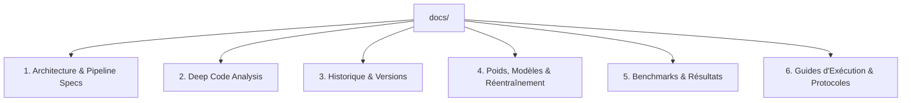

# 📚 Cartographie & Index Documentaire — Sireto.dev

Bienvenue dans le référentiel documentaire officiel du projet **Sireto.dev** (Projet North Star).  
Chaque document est thématisé, versionné et lié aux commits GitHub correspondants.

---

## 🗺️ Navigation Rapide par Thématique

---

## 1. 🏗️ Architecture & Pipeline Specs
Documentation décrivant les flux, principes et spécifications techniques du pipeline :
* [`architecture_v0.md`](file:///c:/Users/Kabouassi/.gemini/antigravity-ide/scratch/Sireto-dev/docs/architecture_v0.md) : Guide d'architecture baseline complet de bout en bout (Étapes 0 à 8, du pré-retrieval au post-decider fallback).
* [`DECISIONS.md`](file:///c:/Users/Kabouassi/.gemini/antigravity-ide/scratch/Sireto-dev/DECISIONS.md) : Registre officiel des décisions d'architecture (SSOT, zéro data leakage, pivot V8b).
* [`AGENTS.md`](file:///c:/Users/Kabouassi/.gemini/antigravity-ide/scratch/Sireto-dev/AGENTS.md) : Règles directrices, diagrammes Mermaid Pipe V6 et Pipe V7.

---

## 2. 🔍 Deep Code Analysis (Audit Pas-à-Pas)
Analyses approfondies, métriques empiriques et revues de code composant par composant :
* [`analysis/analysis_step0_crm_ingestion.md`](file:///c:/Users/Kabouassi/.gemini/antigravity-ide/scratch/Sireto-dev/docs/analysis/analysis_step0_crm_ingestion.md) : Analyse de l'Étape 0 (Ingestion CRM, normalisation, regex voies, découplage retrieval/scoring sur 17k requêtes).
* [`analysis/analysis_step1_partitioned_store.md`](file:///c:/Users/Kabouassi/.gemini/antigravity-ide/scratch/Sireto-dev/docs/analysis/analysis_step1_partitioned_store.md) : Analyse de l'Étape 1 (Stockage Hive Parquet, manifeste $O(1)$, politique méga-communes, cache LRU).
* [`analysis/audit_crm_increment_20260817.md`](file:///c:/Users/Kabouassi/.gemini/antigravity-ide/scratch/Sireto-dev/docs/analysis/audit_crm_increment_20260817.md) : Audit qualité de l'incrément CRM (15 516 cas UNSEEN, zéro doublon SIREN, validation de fusion).

---

## 3. 📜 Historique, Branches & Jalons
Suivi chronologique des versions, branches Git et évolutions :
* [`history/branch_history_and_milestones.md`](file:///c:/Users/Kabouassi/.gemini/antigravity-ide/scratch/Sireto-dev/docs/history/branch_history_and_milestones.md) : Historique complet des versions (V6 $\rightarrow$ V7 $\rightarrow$ Route B $\rightarrow$ V8b) et registre des branches Git.
* [`handover.md`](file:///c:/Users/Kabouassi/.gemini/antigravity-ide/scratch/Sireto-dev/handover.md) : Journal de bord actif, état des lieux courant et traçabilité des commits GitHub.

---

## 4. ⚖️ Poids, Modèles & Réentraînement
Référentiel des hyperparamètres, sampling, fonctions de perte et plans d'optimisation ML :
* [`weights_and_baseline_metrics_v0.md`](file:///c:/Users/Kabouassi/.gemini/antigravity-ide/scratch/Sireto-dev/docs/weights_and_baseline_metrics_v0.md) : Référentiel des poids actuels, ratios de sampling (1:50, hard negatives), hyperparamètres Stage 1/2/3 et baseline SOTA.
* [`plans/plan_v8b_weights_and_retraining.md`](file:///c:/Users/Kabouassi/.gemini/antigravity-ide/scratch/Sireto-dev/docs/plans/plan_v8b_weights_and_retraining.md) : Plan d'optimisation des poids V8b (LambdaMART rank:ndcg, scale_pos_weight 50, recalibration isotonique Stage 3).

---

## 5. 📊 Benchmarks, Évaluations & Résultats
Rapports de performance, métriques et études comparatives :
* `reports/latest_v6a_sota/benchmark_v6a_eval_dual.json` : Résultats de référence V7/V6a (74.5% AUTO @ 99.84% précision).
* `reports/geo_validation/` : Répertoire dédié aux rapports d'évaluation géo (17k baseline et 15k incrément).

---

## 6. 🚀 Guides d'Exécution & Protocoles Utilisateur
Procédures pas-à-pas et scripts pour l'exécution locale :
* [`plans/step2_geo_validation_execution_guide.md`](file:///c:/Users/Kabouassi/.gemini/antigravity-ide/scratch/Sireto-dev/docs/plans/step2_geo_validation_execution_guide.md) : Guide d'exécution de l'Étape 2 (Benchmark Geo 17k baseline).
* [`scripts/run_geo_benchmark_17k.bat`](file:///c:/Users/Kabouassi/.gemini/antigravity-ide/scratch/Sireto-dev/scripts/run_geo_benchmark_17k.bat) : Script batch 1-click pour le benchmark 17k.
* [`scripts/run_geo_benchmark_increment.bat`](file:///c:/Users/Kabouassi/.gemini/antigravity-ide/scratch/Sireto-dev/scripts/run_geo_benchmark_increment.bat) : Script batch 1-click pour le benchmark incrément 15k.
* [`scripts/merge_and_retrain.bat`](file:///c:/Users/Kabouassi/.gemini/antigravity-ide/scratch/Sireto-dev/scripts/merge_and_retrain.bat) : Script batch complet 6 étapes pour la fusion et le réentraînement global.
* [`rules.md`](file:///c:/Users/Kabouassi/.gemini/antigravity-ide/scratch/Sireto-dev/rules.md) : Règles directrices du projet (Règles 1 à 7).
