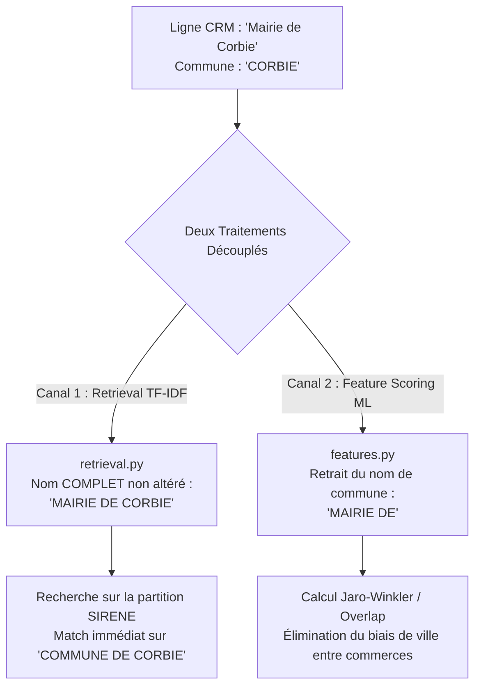

# Rapport d'Analyse : Étape 0 - Ingestion CRM & Pré-traitement Déterministe

**Date** : 20 Août 2026  
**Auteur** : Antigravity & User  
**Fichiers analysés** : [`src/xgb_matcher/features.py`](file:///c:/Users/Kabouassi/.gemini/antigravity-ide/scratch/Sireto-dev/src/xgb_matcher/features.py), [`src/xgb_matcher/naming.py`](file:///c:/Users/Kabouassi/.gemini/antigravity-ide/scratch/Sireto-dev/src/xgb_matcher/naming.py), [`src/xgb_matcher/blocking.py`](file:///c:/Users/Kabouassi/.gemini/antigravity-ide/scratch/Sireto-dev/src/xgb_matcher/blocking.py), [`data/crm_ok_gt.csv`](file:///c:/Users/Kabouassi/.gemini/antigravity-ide/scratch/Sireto-dev/data/crm_ok_gt.csv)

---

## 1. Objectif de l'Analyse
Vérifier que le pré-traitement de la donnée CRM :
1. Couvre 100% des cas d'usage et cas limites (acronymes, alias, stopwords, codes postaux).
2. Ne transforme pas les noms en termes génériques trop faibles pour le retrieval TF-IDF.
3. Préserve l'intégrité des signaux discriminants tout en éliminant les biais géographiques.

---

## 2. Résultats Empiriques sur 17 054 Requêtes CRM

L'audit a été mené sur l'intégralité du Gold Standard de référence :

| Métrique d'Audit | Valeur Mesurée | Pourcentage | Conclusion |
| :--- | :---: | :---: | :--- |
| **Total des requêtes CRM** | **17 054** | 100.00% | Base complète de test |
| **Noms vides après normalisation** | **0** | **0.00%** | Zéro perte de nom |
| **Noms vides après strip géographique** | **0** | **0.00%** | Fallback anti-vide 100% opérationnel |
| **Requêtes vides au TF-IDF** | **0** | **0.00%** | Zéro blocage au retrieval |
| **Noms contenant la commune (strippée)** | **4 001** | 23.46% | Retrait de ville bien circonscrit |
| **Requêtes à token unique au TF-IDF** | **3 722** | 21.82% | Protégées par le canal caractères et adresses |
| **Requêtes ultra-courtes ($\le 3$ caractères)** | **439** | 2.57% | Acronymes capturés par `char_wb` (3-5 n-grammes) |
| **Requêtes purement génériques après strip** | **244** | 1.43% | Discriminées par le filtrage local de la commune |

---

## 3. Architecture du Découplage Retrieval vs Feature Scoring

L'analyse confirme que le pipeline utilise un **découplage architectural strict** :

### Mécanismes de Protection Confirmés :
1. **Au Retrieval** : La requête TF-IDF conserve le nom complet (`crm_row.get("crm_name")`), assurant que les termes de ville présents dans la raison sociale SIRENE sont trouvés.
2. **Au Feature Scoring** : Le `strip_location_from_crm_name` neutralise les faux rapprochements entre deux entreprises distinctes situées dans la même commune.
3. **Sécurité Anti-Vide** : La clause `cleaned = _remove_tokens(...) or original_norm` garantit qu'aucune requête ne devient une chaîne vide.

---

## 4. Conclusion
L'Étape 0 est **validée conforme et optimale**. Aucun ajustement de code n'est requis sur cette phase avant de poursuivre.
