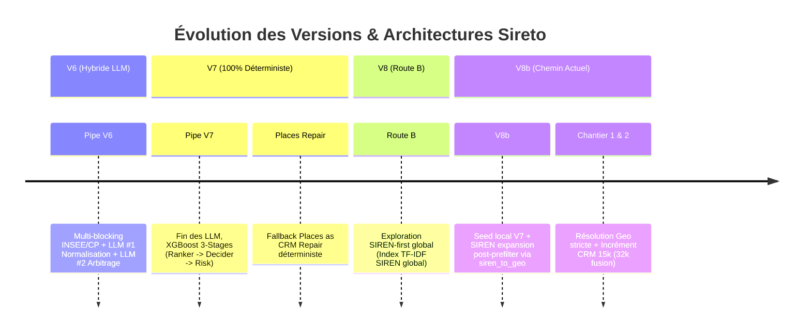

# Historique des Versions & Jalons (Branch & Version History)

**Projet** : Sireto.dev  
**Branche active courante** : `feature/geo-resolution-and-crm-expansion` (issue de `main`)  
**Dernière mise à jour** : 21 Août 2026  

---

## 1. Frise Chronologique des Versions Majeures

---

## 2. Synthèse Détaillée par Version

### Version 6 (Baseline Historique LLM)
- **Architecture** : CSV CRM $\rightarrow$ Cache SQLite SIRENE $\rightarrow$ LLM Ollama #1 (Normalisation/Tags) $\rightarrow$ APIs INPI/DataGouv $\rightarrow$ LLM Ollama #2 (Arbitrage).
- **Statut** : Archivé / Remplacé.
- **Raison du pivot** : Latence élevée, coûts GPU/LLM, variabilité non déterministe.

### Version 7 (XGBoost 3-Stages + Fallback Déterministe)
- **Architecture** :
  - Stage 1 : Fast Ranker (élagage non-sémantique top-50)
  - Stage 2 : Semantic Decider (CamemBERT + scoring XGBoost)
  - Stage 3 : Risk Metamodel (XGBoost + régression isotonique, seuil AUTO 0.835)
  - Fallback : *Places as CRM Repair* (Dept-guard strict + ré-exécution XGBoost binaire).
- **Performance de référence** : **74.5% AUTO @ 99.84% de précision** (sur 2 512 requêtes Test).
- **Statut** : Socle de production validé.

### Version 8 Base (Route B — SIREN-First Global)
- **Concept** : Matching global au niveau SIREN (index TF-IDF global) puis récupération des établissements SIRET géographiques.
- **Statut** : Conservé dans le code pour tests A/B offline (non retenu comme default).
- **Raison** : Moins robuste aux fautes de frappe et noms génériques que le seed local.

### Version 8b (Architecture Actuelle — V7 + SIREN Expansion)
- **Concept** :
  - Conserver le prefilter local V7 (INSEE / CP) comme seed robuste.
  - Ajouter une étape d'expansion SIREN (frères locaux + cross-partition) via `siren_to_geo.parquet`.
  - 7 nouvelles features d'interaction (anti-colocataires, anti-homonymes).
- **Statut** : En cours de validation et déploiement sur le jeu de 32 570 requêtes.

---

## 3. Registre des Branches Git

| Nom de Branche | Base | Rôle / Objectif | Statut |
| :--- | :--- | :--- | :---: |
| `main` | - | Branche stable de production (V7 baseline). | Active / Protégée |
| `feature/geo-resolution-and-crm-expansion` | `main` | Implémentation résolution géo stricte, audit/fusion CRM 32k, et déploiement V8b. | **Active (Courante)** |
| `archive/pipe-v6-llm` | - | Sauvegarde de l'ancienne version avec LLMs. | Archivée |

---

## 4. Matrice des Commits Structurants

| Date | Commit | Auteur | Description & Impact |
| :--- | :---: | :---: | :--- |
| **2026-08-21** | `cd2c3b3` | Antigravity | Scripts batch robustes avec auto-résolution du répertoire racine et logs natifs. |
| **2026-08-21** | `fc4396b` | Antigravity | Branchement de `load_with_geo_resolution` dans `retrieval.py` et création de `evaluate_geo_resolution.py`. |
| **2026-08-20** | `c754b97` | Antigravity | Chantier 1 (Geo resolution) + Chantier 2a/2b (Audit incrément CRM + script merge). |
| **2026-03-01** | `c961371` | Antigravity | Fix chargement dissocié global vs geo pour expansion SIREN en mode geo-only. |
| **2026-03-01** | `9c0e806` | Antigravity | Implémentation de l'expansion SIREN V8b (Step 5 post-prefilter). |
| **2026-02-28** | `3e090b7` | Antigravity | Implémentation Route B (SIREN global index + retrieval SIREN). |
| **2026-02-28** | `35fb441` | Antigravity | Ajout des 7 features d'interaction V8 et hard negatives étendus. |
