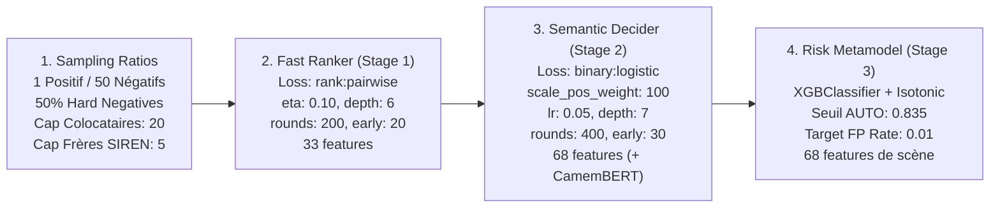

# SIRETO Weights Training & Baseline Metrics (V0)
## Référentiel Officiel des Poids, Données d'Entraînement et Métriques de Référence

**Version** : V0 (Baseline SSOT)  
**Date** : 20 Août 2026  
**Fichiers de code associés** : 
- [`scripts/generate_training_samples_v5fast.py`](file:///c:/Users/Kabouassi/.gemini/antigravity-ide/scratch/Sireto-dev/scripts/generate_training_samples_v5fast.py)
- [`scripts/train_xgb_ranker.py`](file:///c:/Users/Kabouassi/.gemini/antigravity-ide/scratch/Sireto-dev/scripts/train_xgb_ranker.py)
- [`scripts/train_xgb_decider.py`](file:///c:/Users/Kabouassi/.gemini/antigravity-ide/scratch/Sireto-dev/scripts/train_xgb_decider.py)
- [`scripts/train_routing_risk_model.py`](file:///c:/Users/Kabouassi/.gemini/antigravity-ide/scratch/Sireto-dev/scripts/train_routing_risk_model.py)
- [`data/crm_ok_gt.csv`](file:///c:/Users/Kabouassi/.gemini/antigravity-ide/scratch/Sireto-dev/data/crm_ok_gt.csv)
- [`reports/latest_v6a_sota/benchmark_v6a_eval_dual.json`](file:///c:/Users/Kabouassi/.gemini/antigravity-ide/scratch/Sireto-dev/reports/latest_v6a_sota/benchmark_v6a_eval_dual.json)

---

## 1. Périmètre & Typologie des Données d'Entraînement

### A. Volume Global
- **Base Gold Standard** : [`data/crm_ok_gt.csv`](file:///c:/Users/Kabouassi/.gemini/antigravity-ide/scratch/Sireto-dev/data/crm_ok_gt.csv)
- **Total des requêtes CRM étudiées** : **17 054 requêtes**
- **Base SIRENE nationale associée** : **14 000 000+ établissements** (parquets officiels INSEE).

### B. Typologie des 17 054 Cas CRM
| Typologie du Cas | Volume | Pourcentage | Traitement dans le Pipeline |
| :--- | :---: | :---: | :--- |
| **Établissements Actifs (`A`)** | 13 841 | **81.16%** | Cible principale de matching |
| **Établissements Fermés / Radiés (`F`)** | 3 213 | **18.84%** | Conservés comme gardiens anti-faux positifs |
| **Match géographique INSEE exact** | 16 775 | **98.36%** | Chargement direct partition communale |
| **Match géographique CP seul (`cp_only`)** | 279 | **1.64%** | Communes limitrophes / fusions municipales |

### C. Découpage par Groupe SIREN (Zero Data Leakage)
Le partitionnement est groupé par identifiant **SIREN** pour garantir l'absence totale de fuite de données entre l'entraînement et l'évaluation :

| Split | Proportion | Nombre de Requêtes CRM | Volume de Paires (CRM $\times$ Candidats) |
| :--- | :---: | :---: | :---: |
| **Train** | **70%** | **11 347** | 578 627 paires |
| **Dev (Validation)** | **15%** | **2 472** | 126 029 paires |
| **Test (Benchmark officiel)** | **15%** | **2 544** *(2 512 strictes)* | 129 738 paires |
| **Total** | **100%** | **17 054** | **834 394 paires** |

---

## 2. Configuration des Poids & Hyperparamètres Actifs

### A. Ratios d'Échantillonnage et Hard Negatives ([`generate_training_samples_v5fast.py`](file:///c:/Users/Kabouassi/.gemini/antigravity-ide/scratch/Sireto-dev/scripts/generate_training_samples_v5fast.py))
- **Ratio Positif / Négatif** : `1 : 50` (`MAX_NEGATIVES = 50`).
- **Ratio Hard Negatives** : `0.5` (`HARD_RATIO = 0.5` : 25 candidats difficiles issus du Ranker + 25 négatifs aléatoires/TF-IDF).
- **Plafond Colocataires même adresse** : `20` (`SAME_ADDR_NEG_MAX = 20`).
- **Plafond Établissements frères par SIREN (V8b)** : `5` (`max_sirets_per_siren = 5`).
- **Plafond Pool après Expansion SIREN** : `500` (`siren_expansion_pool_cap = 500`).

### B. Stage 1 - Fast Ranker ([`train_xgb_ranker.py`](file:///c:/Users/Kabouassi/.gemini/antigravity-ide/scratch/Sireto-dev/scripts/train_xgb_ranker.py))
- **Objectif / Loss** : `rank:pairwise`
- **Taux d'apprentissage ($\eta$)** : `0.10`
- **Profondeur maximale (`max_depth`)** : `6`
- **Échantillonnage (`subsample` / `colsample_bytree`)** : `0.80 / 0.80`
- **Boosting rounds (`num_boost_round`)** : `200` (Early stopping : 20)
- **Métrique d'évaluation** : `["ndcg@5", "map@5"]`
- **Features utilisées** : 33 features lexicales et géographiques non-sémantiques ([`FAST_RANKER_FEATURE_NAMES`](file:///c:/Users/Kabouassi/.gemini/antigravity-ide/scratch/Sireto-dev/src/xgb_matcher/features.py#L227)).

### C. Stage 2 - Semantic Decider ([`train_xgb_decider.py`](file:///c:/Users/Kabouassi/.gemini/antigravity-ide/scratch/Sireto-dev/scripts/train_xgb_decider.py))
- **Objectif / Loss** : `binary:logistic`
- **Poids de classe (`scale_pos_weight`)** : **`100`** *(sur-pondération des positifs face aux 50 négatifs)*
- **Taux d'apprentissage (`learning_rate`)** : `0.05`
- **Profondeur maximale (`max_depth`)** : `7`
- **Poids minimum par feuille (`min_child_weight`)** : `3`
- **Échantillonnage (`subsample` / `colsample_bytree`)** : `0.80 / 0.80`
- **Boosting rounds** : `400` (Early stopping : 30)
- **Métrique d'évaluation** : `["auc", "logloss"]`
- **Features utilisées** : 68 features complètes incluant les similarités cosinus CamemBERT et les 7 features d'interaction V8.

### D. Stage 3 - Risk Metamodel ([`train_routing_risk_model.py`](file:///c:/Users/Kabouassi/.gemini/antigravity-ide/scratch/Sireto-dev/scripts/train_routing_risk_model.py))
- **Architecture** : `XGBClassifier` (100 arbres, profondeur 4, lr 0.1)
- **Calibrateur de probabilité** : `IsotonicRegression`
- **Seuil de Décision AUTO** : **`0.835`**
- **Cible de faux positifs** : `target_fp_rate = 0.01`
- **Entrées** : 68 features décrivant la scène de décision (`score_top1`, `score_top2`, `score_gap`, `score_ratio`, $\Delta \text{features}$).

---

## 3. Métriques et Performances de Référence (SOTA Actuel)

### A. Résultats sur le Test Set Officiel (2 512 requêtes)
- **Source** : [`reports/latest_v6a_sota/benchmark_v6a_eval_dual.json`](file:///c:/Users/Kabouassi/.gemini/antigravity-ide/scratch/Sireto-dev/reports/latest_v6a_sota/benchmark_v6a_eval_dual.json)

| Indicateur de Performance | Valeur Mesurée | Règle Métier |
| :--- | :---: | :--- |
| **Auto Match Rate** | **74.5%** *(1 872 / 2 512)* | Cible $\ge 70-75\%$ atteinte |
| **Précision AUTO réelle** | **99.84%** *(seulement 3 faux positifs sur 1 872)* | Cible Zéro FP ($\ge 99.80\%$) atteinte |
| **Taux de REVIEW** | **25.5%** *(640 cas)* | Aiguillés vers le fallback Places |
| **Précision SIREN** | **99.84%** | Identification de l'entité juridique |
| **Précision SIRET** | **99.84%** | Identification de l'établissement exact |

### B. Entonnoir de Rétention (Recall Funnel)
1. **Étape 1 (Base communale SIRENE)** : **99.1%** de présence du bon SIRET.
2. **Étape 2 (Retrieval Top-500 + Whitelist)** : **98.8%** de présence du bon SIRET.
3. **Étape 4 (Fast Ranker Recall@50)** : **98.2%** de présence dans les 50 finalistes.
4. **Étape 5 (Semantic Decider Hit@1)** : **91.2%** de bon SIRET en Top-1 absolu.
5. **Étape 6 (Risk Model Seuil 0.835)** : **74.5%** certifiés en AUTO à $99.84\%$ de précision.
